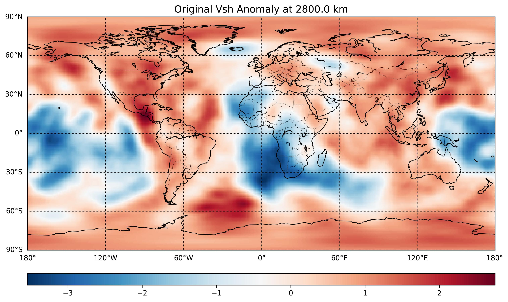
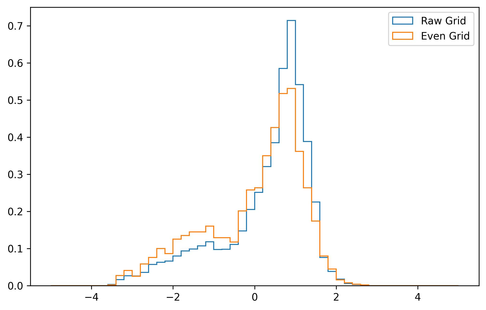
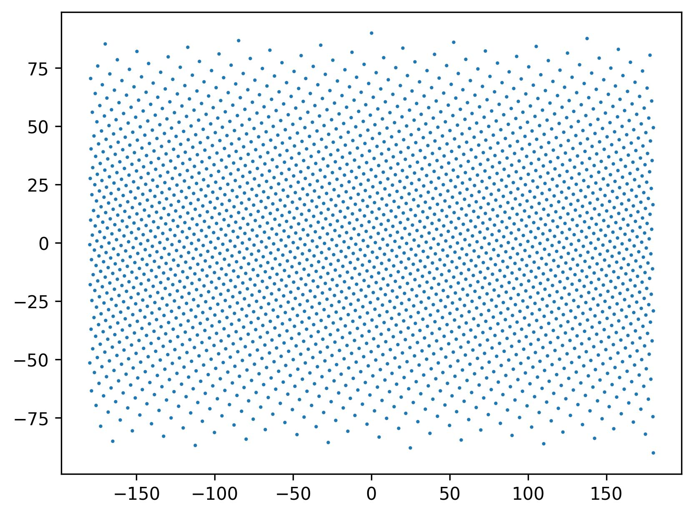
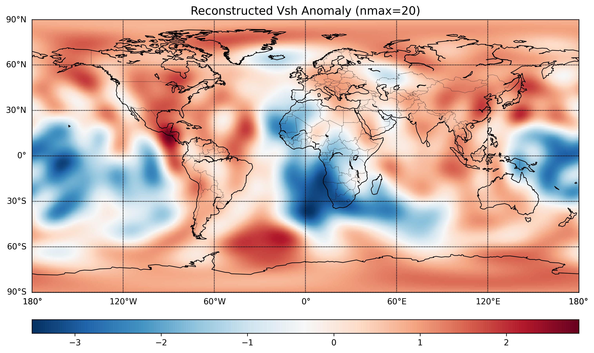

# EMC-Tools

A Python utility toolkit for analyzing and visualizing global seismic tomography models in IRIS EMC repository. 

## Available Features

### 📂 Data I/O & Inspection
- **`inspect_netcdf`**: Quick overview of NetCDF variables, dimensions, and global attributes.
- **`get_nc_slice`**: Efficiently extract 2D latitude-longitude slices at a specific depth from 3D tomography volumes.

### 🌍 Geophysical Processing
- **`calculate_surface_average`**: Compute the global mean using spherical area weighting ($\sin\theta$).
- **`get_velocity_anomaly`**: Convert absolute velocity to percentage anomaly $(dV/V_{mean})$ based on surface-weighted averages.

### 📊 Statistical Resampling
- **`resample_tomography`**: Map regular lat-lon grids onto an **evenly distributed grid** (Fibonacci Sphere) to eliminate polar oversampling during clustering or statistical analysis.

### 🎼 Spectral Analysis (Spherical Harmonics)
- **`run_sh_analysis`**: Perform spherical harmonic decomposition (Analysis) using the high-performance `shtns` library.
- **`reconstruct_from_sh`**: Re-synthesize spatial fields from coefficients (Synthesis) for consistency checks or spectral filtering.
- **`degree_amplitude`**: Calculate power spectrum/amplitude for each degree $l$.

### 🗺️ Visualization
- **`plot_map_basemap`**: Generate publication-quality global maps with customized projections, coastlines, and symmetric color scales (e.g., RdBu).

## 🖼️ Gallery (Example Output)

Below are the results generated from `example.py` using the **GLAD-M35** model at 2800 km depth:

| 1. Velocity Anomaly Map | 2. Statistical PDF Comparison |
|:---:|:---:|
|  |  |
| *Global dV anomaly using Basemap* | *Raw vs. Evenly-sampled grid distribution* |

| 3. Evenly Distributed Grid | 4. SH Reconstruction (nmax=20) |
|:---:|:---:|
|  |  |
| *Fibonacci Sphere sampling points* | *Synthesis check after SH Analysis* |

## Requirements
- `netCDF4`, `numpy`, `scipy`, `matplotlib`
- `basemap` (for 2D mapping)
- `shtns` (for spherical harmonics)